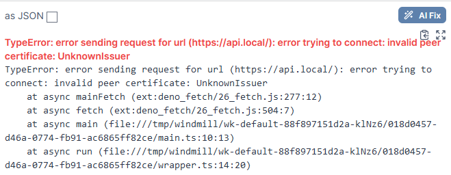
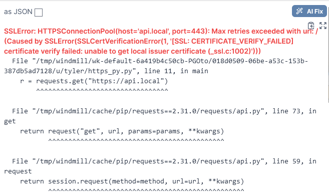
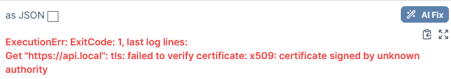
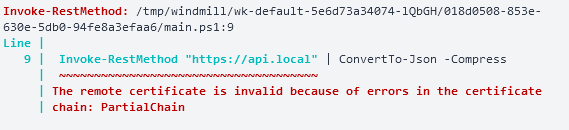
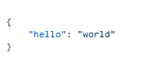

+++
title = 'Configuring Windmill to Trust Internal/Corporate CAs'
date = 2024-01-13T20:26:53-06:00
draft = false
tags = ['windmill', 'tls']
+++

# TL;DR

1. **Mount CA Certificates in Windmill**
   - Ensure CA certificate is base64 encoded and has `.crt` extension.
   - Create a directory for CA certificates.
   - Modify `docker-compose.yml` to mount this directory to `/usr/local/share/ca-certificates` in read-only mode.
   - Use `INIT_SCRIPT` environment variable to run `update-ca-certificates` in worker containers.

2. **Establish Deno's Trust**
   - Set environment variable `DENO_TLS_CA_STORE=system,mozilla` in `docker-compose.yml` for Windmill workers.

3. **Configure Python (requests) Trust**
   - Set `REQUESTS_CA_BUNDLE=/etc/ssl/certs/ca-certificates.crt` in the worker's environment variables.
   - Add `WHITELIST_ENVS=REQUESTS_CA_BUNDLE` to explicitly allow this variable in Windmill workers. 

# Introduction

[Windmill](https://github.com/windmill-labs/windmill) is awesome. It allows you to create internal tools and workflows rapidly. But when working on _internal_ tools in Windmill, you've probably come across these errors when trying to reach _internal_ endpoints at least once or twice.









The reason for this is Windmill, and the runtimes bundled with its workers, trust the [CA Mozilla bundle](https://wiki.mozilla.org/CA) by default. Often, you might need a script to reach a service internally that is using TLS, but the certificates it uses are signed by some internal CA, or other CA that is just not included in Mozilla's CA bundle. You might have these CA certificates trusted on the server running Windmill containers, but we actually need to get these containers (and runtimes) to trust the certificates themselves.

I will take you through a solution to this problem which **avoids** disabling SSL verification. We will focus on making sure it works with at least Deno, Go, PowerShell, and Python (requests).

# Getting your CA certificates inside of Windmill

The first thing we need to do is expose our CA certificates to the workers which run our scripts. We must know a few things before doing this:

- What distribution is the worker image built upon?
    - The Windmill image which is used for worker containers is built upon **Debian**.
    - You can see this for yourself looking at its [Dockerfile](https://github.com/windmill-labs/windmill/blob/main/Dockerfile)
- How do we get this distribution to trust a user-specified CA certificate?
    - In Debian, we use [ca-certificates](https://manpages.debian.org/buster/ca-certificates/index.html) and its tool `update-ca-certificates`

Knowing this information, we now know we need to:
1. Mount our CA cert inside of `/usr/local/share/ca-certificates`
2. Run `update-ca-certificates` when these worker containers are created

## Mounting our CA certificate

**Prerequisites**:
- Have your CA certificate copied onto the machine running Windmill
- Ensure your CA certificate is base64 encoded
- Ensure your CA certificate ends with a `.crt` extension

1. Create a directory that will hold your CA certificates that you wish to expose to Windmill
2. Add a line to the windmill_worker service in your `docker-compose.yml` file to mount this new directory
    - Here we mount a directory named `ca` to `/usr/local/share/ca-certificates`
    - We also make this volume read-only as there is no reason for the worker to ever modify this
3. Leverage the `INIT_SCRIPT` env variable to run `update-ca-certificates` when worker containers come up

```yaml
  windmill_worker:
    image: ${WM_IMAGE}
    # ...
    # ...
    environment:
      - DATABASE_URL=${DATABASE_URL}
      - MODE=worker
      - WORKER_GROUP=default
      - INIT_SCRIPT=update-ca-certificates
    volumes:
      - /var/run/docker.sock:/var/run/docker.sock
      - worker_dependency_cache:/tmp/windmill/cache
      - ./ca:/usr/local/share/ca-certificates:ro # Our new line!
```

> **NOTE**: You could technically mount the single file cert bundle from the container host instead (if you know where it is as it varies from distros), avoiding the need to perform `update-ca-certificates`. However, this requires you to trust the CA certificate on the container host itself.

# First Test

Now that we have our CA certificates in place let's test functionality. Our test will be trying to hit a TLS protected API https://api.local that was signed with an internal CA in my lab.

[Scripts used for testing](#scripts-used-for-testing)

## Deno & Python

Our Deno and Python tests failed. They still do not trust the issuer of api.local's certificate


## Go & PowerShell

Go and PowerShell now both trust our internally signed certificate!


**Go**:


**PowerShell**:



# Getting Deno's trust

Deno is a bit of a security nut (which is a good thing!). Because of this, however, we need to take some extra steps to have it trust the CA certificates we just mounted. Luckily the Deno team knows about this and [provides a solution](https://docs.deno.com/runtime/manual/getting_started/setup_your_environment#environment-variables).

We set an environment variable `DENO_TLS_CA_STORE` to tell Deno to use our system's CA store. All we need to do is have this set inside of our workers. Again, we will modify the `docker-compose.yml` for this.

```yml
  windmill_worker:
    image: ${WM_IMAGE}
    # ...
    environment:
      - DATABASE_URL=${DATABASE_URL}
      - MODE=worker
      - WORKER_GROUP=default
      - DENO_TLS_CA_STORE=system,mozilla # Our new line!
      - INIT_SCRIPT=update-ca-certificates
    volumes:
      # ...
      - ./ca:/usr/local/share/ca-certificates:ro

```

We actually set it to the value `system,mozilla` instead of just `system`. This way Deno has its original store still just in case the Mozilla CA bundle in the worker's system CA store ever goes haywire (probably due to me messing it up, really).

# Getting Python's (requests) trust

The `requests` library we use for Python uses the CA certificates from the `certifi` library (more info [here](https://requests.readthedocs.io/en/latest/user/advanced/#ca-certificates)). We can tell it, just like Deno, to use our systems CA store. However, we actually need to tell it where that store is located. (Refer back to the  for how `ca-certificates` work on Debian)

```yaml
windmill_worker:
  image: ${WM_IMAGE}
  # ...
  environment:
    - DATABASE_URL=${DATABASE_URL}
    - MODE=worker
    - WORKER_GROUP=default
    - REQUESTS_CA_BUNDLE=/etc/ssl/certs/ca-certificates.crt # Our new line!
    - DENO_TLS_CA_STORE=system,mozilla
    - INIT_SCRIPT=update-ca-certificates
```

But **wait**! Before you start testing, you should know if we run this now Python's `requests` library does not actually see the new environment variable we just defined. Why? Since these environment variables can contain sensitive information, and we are running a lot of 3rd party code in our scripts, they are not passed into the script by default.

You might ask how is this any different than Deno? Well Deno actually uses its environment variable when building its runtime arguments, but that is technically outside of our script (before it). Python's `requests` library, however, would need to access our new environment variable while our script is running. To do this, we need to _explicitly_ allow specific environment variables to be passed through to our workers. We will add a `WHITELIST_ENVS` line to do this (more info [here](https://github.com/windmill-labs/windmill/blob/main/README.md)).

```yaml
windmill_worker:
  image: ${WM_IMAGE}
  # ...
  environment:
    - DATABASE_URL=${DATABASE_URL}
    - MODE=worker
    - WORKER_GROUP=default
    - REQUESTS_CA_BUNDLE=/etc/ssl/certs/ca-certificates.crt
    - DENO_TLS_CA_STORE=system,mozilla
    - INIT_SCRIPT=update-ca-certificates
    - WHITELIST_ENVS=REQUESTS_CA_BUNDLE # Our new line!
```

# Second Test

Our Deno and Python tests now both succeed!

## Deno


## Python


# Scripts used for testing

## Deno

```typescript
export async function main() {
  const r = await fetch("https://api.local");
  return await r.json();
}
```

## Go

```go
package inner

import (
	"net/http"
)

func main() (bool, error) {
	resp, err := http.Get("https://api.local")
	if err != nil {
		return false, err
	}
	defer resp.Body.Close()

	if resp.StatusCode >= 200 && resp.StatusCode <= 299 {
		return true, nil
	}

	return false, nil
}
```

## PowerShell

```powershell
Invoke-RestMethod "https://api.local" | ConvertTo-Json -Compress
```

## Python

```python
import requests

def main():
    r = requests.get("https://api.local")

    return r.json()

```
